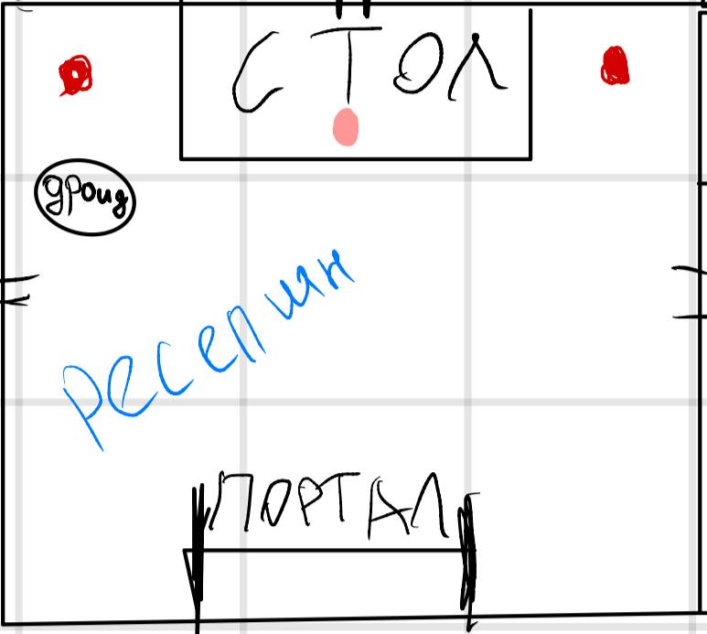
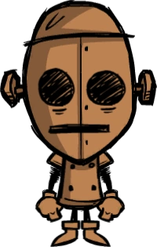
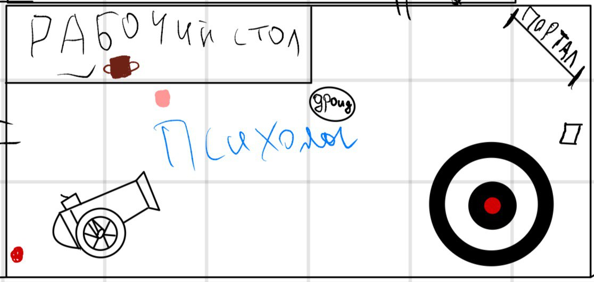
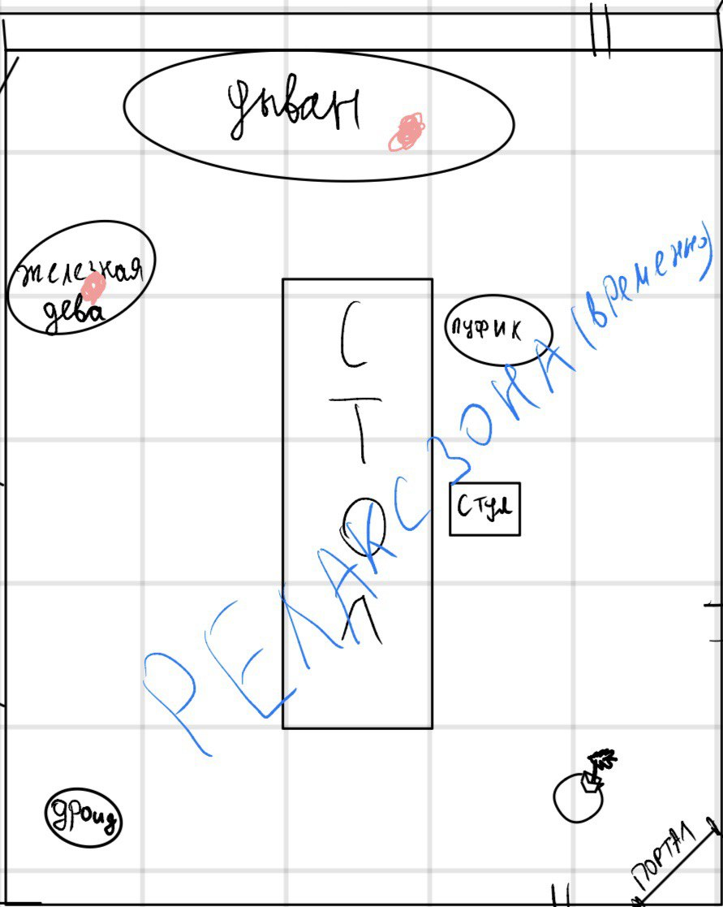
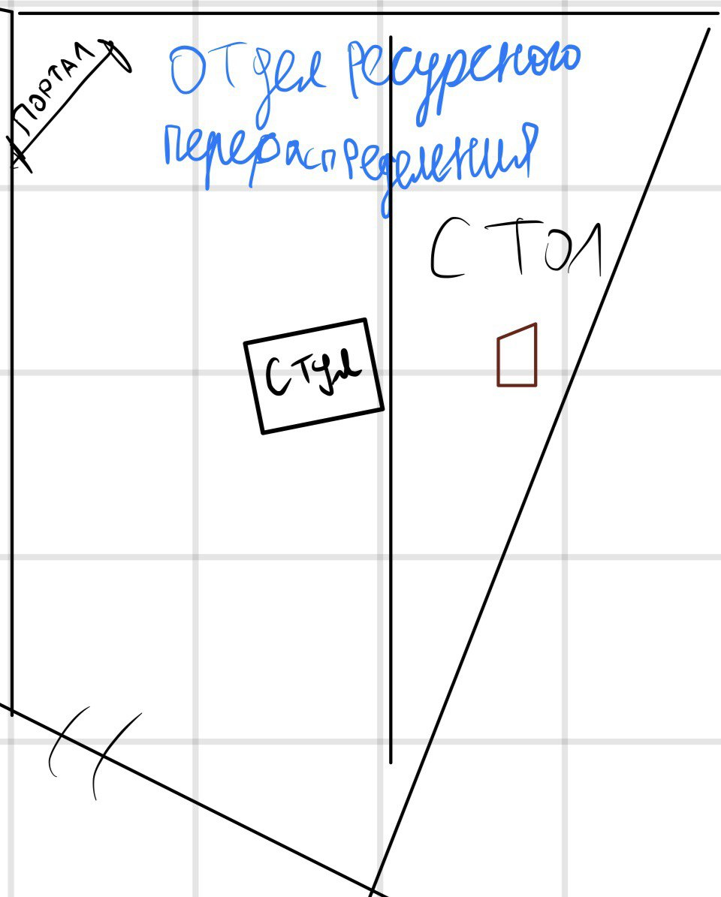
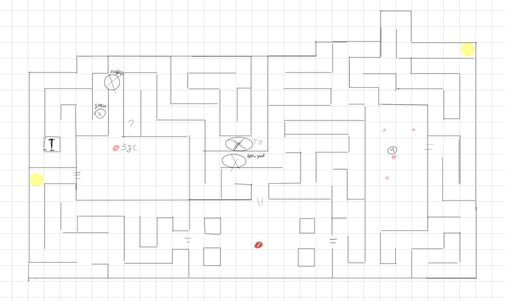

# Перенос в лабораторию
 
Кованный - гуманоидная машина с номером 23
Две обезьяны с саблями жуют бананы и играют в карты
```
Госпожа Фелонь
```
> Здравствуйте, чем могу я вам помочь
> ...
> Вы новенькие!? Давайте я посмотрю вас по системе, о, ваш непосредственный руководитель - Профессор Калигула
> Провожу вас к вашему руководителю


Как только вы заходите перед вами открывается чудесный вид:
Обезьяна наводит пушку на бедного, держащевого в руках большую мишень.
И человек в халате попивающий что-то из кружки
На стене висит большой плакат "ваш мозг - моя цель"
Кованный с пола пожирает разорванную плоть, судя по всему, это пушечное ядро так разворатило беднягу    
```
Госпожа Фелонь
```
> Господин Златофус, одолжите вашего последнего лаборанта, нужны кадры для Калига
```
Златофус
```
> Ох, ну, раз надо... ЧИЧИ, туши фитиль

# Переход к профессору Калигулы

Вы проходите в комнату, с незаконченной отделкой: еще не замазаны дымные пятна от взрыва. Посередине вы видите стол, на котором на красивых тарелках расположены различные фрукты, а рядом сними несколько дымящихся колб со светящимися жидкостями. Вы замечаете железную деву, внутри которой вот-вот распрощается со своей жизнью темный эльф. Она еще открыта, но бедняга уже привязан ремнями и по лицу видно, что он уже смирился с участью. А рядом на диване сидит высший эльф и, попивая Пинту, листает тоненькую книженцию. 
Кованный дроид в углу терпеливо ждет. 

Прекрасная девушка ведет вас к другой двери. 

Каменный достаточно длинный коридор открываются вашему взору, по бокам его виднеются множество дверей. Вы проходите 4 двери, располагающихся по разные стороны коридора, с надписями «**гардегробная**», «**комната**», «**Кафедра экстремальной гидропоники**», «**Складское помещение**»

Вас подводят к двум рядом стоящим дверям с табличками: "**отдел ресурсного перераспределения**", "**отдел этики**"

# Кабинет Калигулы

Вы попадаете в скромный кабинет, добротную часть которой занимает стол с кучей кип бумаг и несколько странных устройств, с торчащими катушками, лампами и клапанами.

на стуле сидит человек с разочарованием на лице.

(под столом люк)
```
Профессор Калигула
```
*преобразовываясь в лице*
> О, Фелонь, спасибо, милая.
> И так, коллеги, у меня проблемка, мне нужен **жетон изобилия**. Без него я не могу работать, принесите его мне. Я примерно нашел, где он находится, но, к сожалению что-то мешает мне напрямую туда поставить врата. Отправляйтесь немедленно.
> Задержите дыхание, а то умрете
> ах, да... У меня кстати туда сбежал эксперимент, он очень опа...

# Лабиринт

## Ловушки
-  Старые змеи **(обыграть как-то)**
- [медвежья ловушка](../npcs/bear.md)
- Телепорт
- Антигравитационная


```
Зус
```
> - Вы от доктора Бума пришли на помошь ?
> - Я восхищаюсь его гениальнейший эксперимент с бутербродом и черной дырой
> - Сам пишу работы, правда не такие гениальные
> - 
> - Он меня здесь оставил помирать - вот невоспитанный, да??
> - Я думал, вы знаете, что делаете
> - 
> - 


## Босс
[Желешка](../npcs/gelatinous_cube.md)


дать 

# Возвращение

```
Профессор Калигула
```
> О, спасибо вам господа, вы просто спасли меня.

Подходит к странной машине и опускает жетон
Наливается напиток в стакан
> Не могу работать без кофе