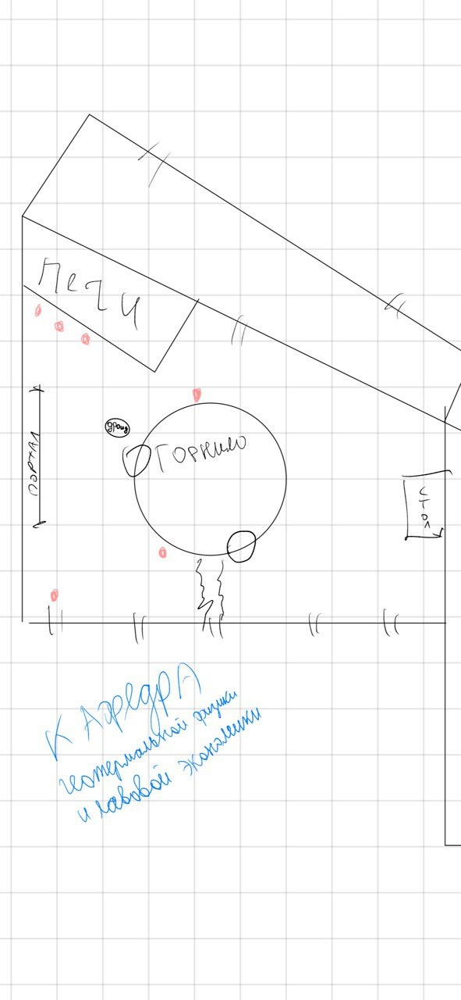
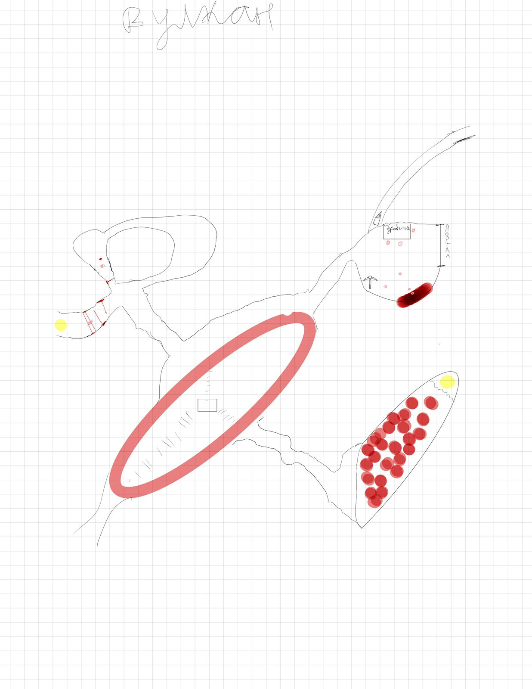
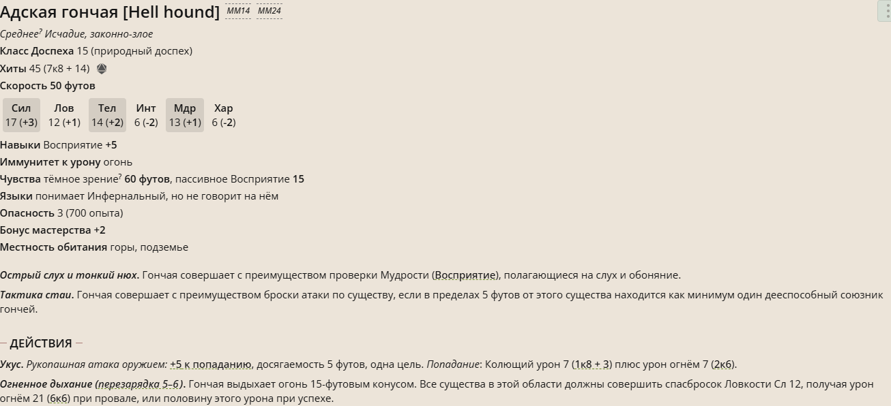

[магаз](../store/store.md)
# Могут отдохнуть в комнате релаксации или поесть в кафетерии

# Кафедра геотермальной физики и лавовой экономики

```
Доктор Пиролит
``` 

> Мои горючие, вы как раз во время, вот прошу надевайте асбестовый костюм (***2 штуки***)
> по статистике каждый третий костюм не спасает, поэтому я решил сэкономить

> - Кислород для слабаков. Настоящий мужчина дышит сероводородом
> - Кажется я расплавил того стажера, но зато какие данные
> - Вулканы это природа кашляет, наша задача - подставить ведерко

# Путь на вулкан



# Мост с адскими гончими


Адские твари пожирают несчастного рудоискателя


---

Озеро лавы
Сломанный мост

---

Умирающий мастер и его подмасетрье
> - Ты старый дурак, нет никакого философского камня
> - Мальчик мой, прошу у меня сердце, не надо
> - Нет, ворчливый старикан надо! Ты веришь в чушь и из-за нее погубишь нас
> Отдай сплав мне и пойдем
> - НЕЕЕТ, эта работа всей моей жизни

Вы слышите как молодой голос надрывается в боевом кличе и приглушенные крики старческого хрипа 

Резкий звук удара металла о металл и тишина

Старый пожилой мастеровой с огромной колотой раной прямо в груди, а на земле с отрубленной головой лежит еще совсем юный подросток

Гигансткий лист из удивительно красивого сплава лежит рядом


Старик усмехаясь смотрит на вас и бормочет

> Эх, не успел сдать отчет по технике безопасности

> Передайте пиролиту, что я не смогу закончить отчет

рассказывает про свойства сплава. 


--- 

Соответсенно лавовые гейзеры

---

Штука где можно пробратья к руде с помощью заклинания