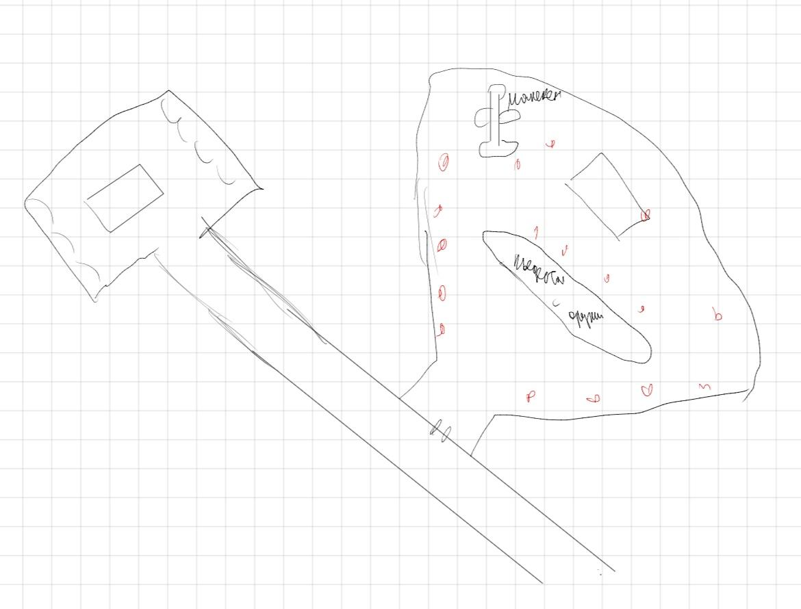

# Отдел по изготовлению и испытанию гигантских механо-пневматических обезьяних роборук для массовых но частично контролируемых разрушений

> Приветсвую, вы наверно думаете, что мне от вас что-то нужно ? Думаете, что я вас о чем-то попрошу ? 
ХАХА, нет. Просто помогите мне выбрать какая пушка больше подходит к роборуке

>**"Боже мой, это же элементарно! Ваш дизайн кричит, как оперная дива без голоса!"**  
**"Кто разрешил вам соединять эти компоненты? Это же хуже, чем носить носки с сандалиями!"**  
**"Этот реактив так же стабилен, как моя тёща после трёх мартини!"**  
**"Вы что, собираетесь запускать это в производство? Это же позор для всей инженерии!"**  
**"Ах, да, конечно, давайте просто сделаем это ! Ведь эстетика — понятие абстрактное, не так ли?"**  
**"Ваш прототип выглядит так, будто его собирал пьяный робот в темноте!"**  
**"О, великолепно! Вы изобрели новый способ разочаровывать науку!"**  
**"Этот сплав — не просто ошибка, это преступление против хорошего вкуса!"**  
**"Если бы у безвкусицы была физическая форма, это был бы ваш чертёж!"**  
 **"Мои кошки в лаборатории проектируют лучше, и у них лапки!"**  

